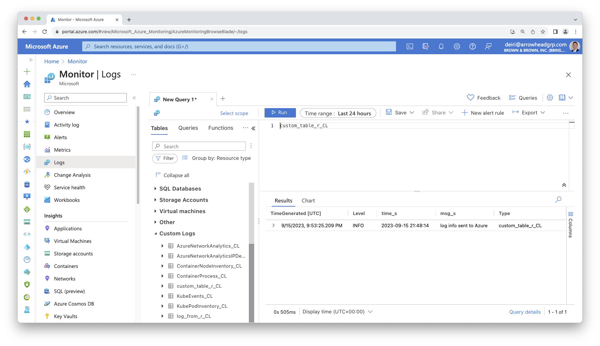
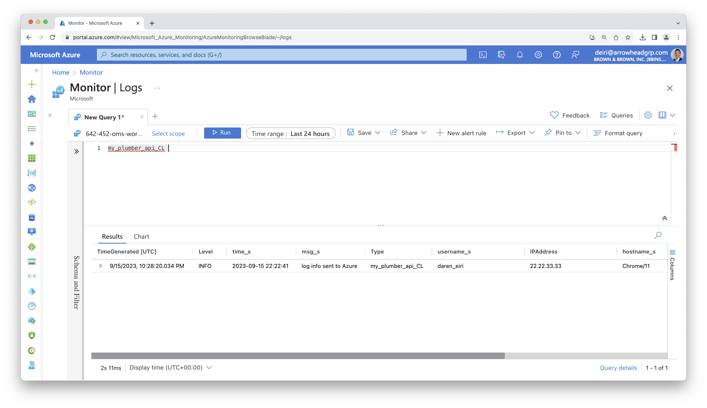

06 - Using The azlogr Package To Send Logs via API
================
2023-09-08

- [Requirements: Getting Azure Log Analytics
  Information](#requirements-getting-azure-log-analytics-information)
- [Set Up](#set-up)
- [Using azlogr to send logs via
  API](#using-azlogr-to-send-logs-via-api)
- [Sending additional fields](#sending-additional-fields)

In the previous section we configured our code to log to a
`syslog_appender` using the log4r package. There are some limitations in
that it requires a certain type of infrastructure (Linux VM, capability
to write to your systems syslog).

If you run into any IT restrictions, it can be easier to instead make an
API call.

The package [azlogr](https://atalv.github.io/azlogr/) is a great option
for sending your logs to your Azure Log Analytics Workspace. It is built
on top of the logger package, so the examples below are not related to
the log4r package. The concepts, however, are generally very similar.

# Requirements: Getting Azure Log Analytics Information

To send logs to Azure Log Analytics via API, you need some information
to identify where to send the logs, and for authentication.

1.  Azure Log Analytics Customer/Workspace ID
2.  [View Microsoft
    Documentation](https://learn.microsoft.com/en-us/bonsai/cookbook/get-law-id)
    to find this Workspace ID
3.  Azure Log Analytics Shared Key
4.  [See this Microsoft
    thread](https://learn.microsoft.com/en-us/answers/questions/1154380/where-is-azure-is-the-primary-key-and-workspace-id)
    for finding your shared Key.

# Set Up

Because you are using sensitive information, you should set up an
`.Renviron` file to store your Workspace ID and Shared Key values. [Read
about using environment variables or storing secret values with the
Posit Solutions
Guide](https://solutions.posit.co/connections/db/best-practices/managing-credentials/#use-environment-variables)

Here’s an example `.Renviron` file:

``` r
AZ_LOG_ID="00000000-0000-0000-0000-000000000000"
AZ_LOG_KEY="5LLi6guNfYKJ0ipSY9cv0NJ8ZeOAHlz7dX0hI9S5RTI6ISnGwa3aTvq/Mzg2SlwaaRqkZAAaSiYStlpx48y8zQ=="
# The above Key is not real, but is representative of what it should look like
```

Be sure to also review [azlogr’s vignette on How to Use
azlogr](https://atalv.github.io/azlogr/articles/how-to-use-azlogr.html)

# Using azlogr to send logs via API

``` r
# Azure Log Analytics workspace id and shared key are fetched from Azure Portal
AZ_LOG_ID = Sys.getenv("AZ_LOG_ID")
AZ_LOG_KEY = Sys.getenv("AZ_LOG_KEY")

library(azlogr)


set_log_config(
  log_fields = c("level", "time", "msg"),
  log_type = "custom_table_r"
)

# Use logger_* functions with appropriate logging level to log.
# If POST is successful, then it will be available in custom log table on
# Azure Log Analytics, by default table name will be `log_from_r4`_CL (_CL is
# added by Azure for any custom log table)
logger_info("log info sent to Azure")
```

You can then view the results in Azure Monitor Logs. Note that it does
take a few minutes for the log data to appear, so it is not
instantaneous. See the time difference between `time_s` and
`TimeGenerated`.



You can start to imagine that if you had multiple APIs, you could
separate your logs into its own table. You could also send structured
data, which may be valuable if you want to track specific users,
accounts, etc.

# Sending additional fields

Let’s add a few additional metadata fields in `set_log_config`. We’ll
pretend we’re storing user-specific information that may be useful for
future debugging.

``` r
# Azure Log Analytics workspace id and shared key are fetched from Azure Portal
AZ_LOG_ID = Sys.getenv("AZ_LOG_ID")
AZ_LOG_KEY = Sys.getenv("AZ_LOG_KEY")

library(azlogr)

# Hard-coded examples, but an API could collect this information and
# pass it along to `set_log_config`
user_name <- "daren_eiri"
ip_address <- "22.22.33.33"
host_name <- "Chrome/11"


# Note that log_type does not accept "-"; you will receive a 400 error
set_log_config(
  log_fields = c("time", "level", "msg", "username", "ipaddress", "hostname"),
  additional_fields = list(username = user_name, ipaddress = ip_address, hostname = host_name),
  log_type = "my_plumber_api"
)

logger_info("log info sent to Azure")
```

Now we have more structured logging!


