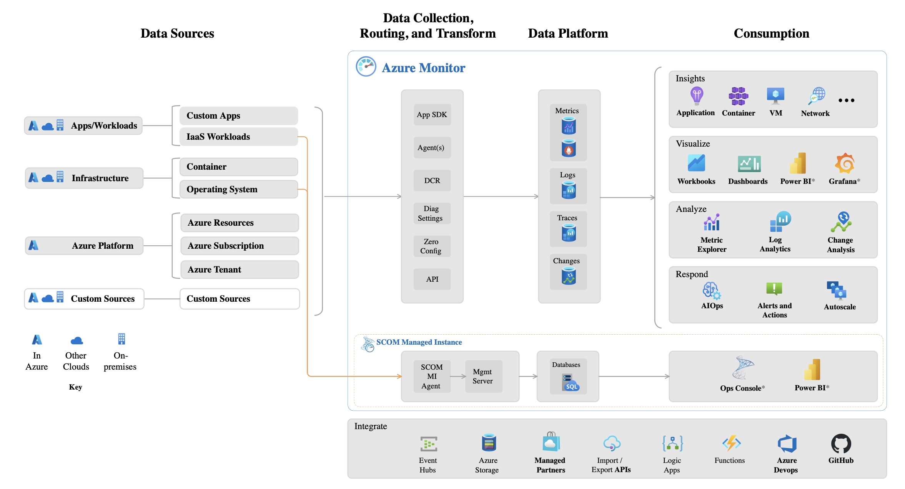
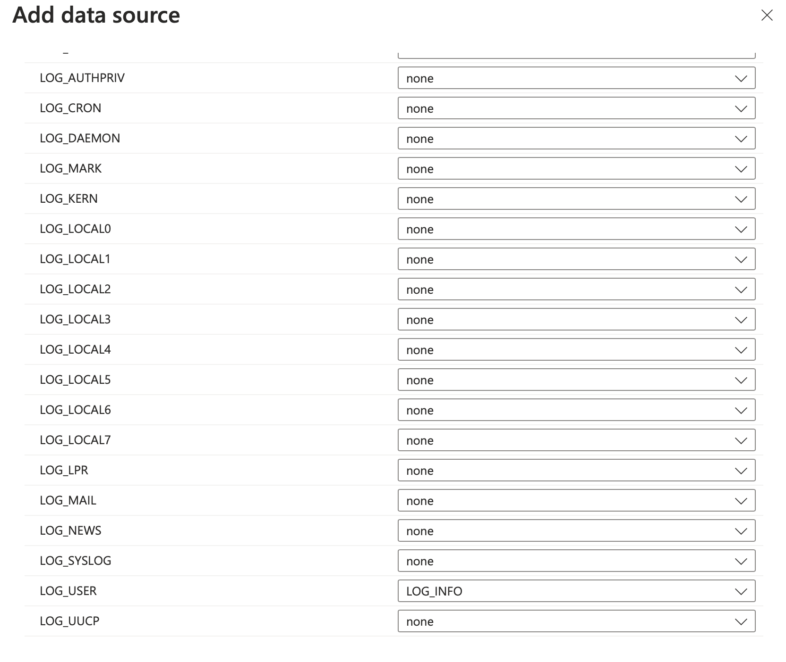
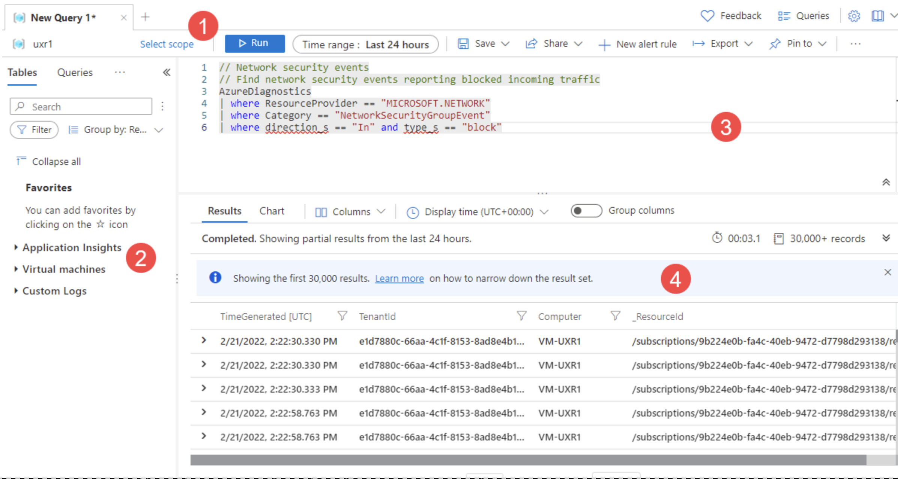
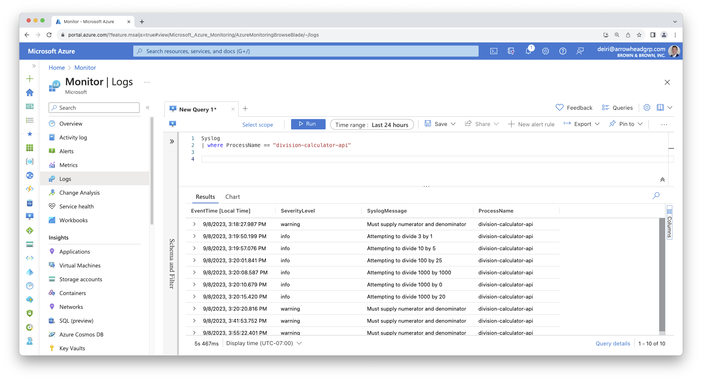

We should now have an understanding of how we can use log4r to add logging in our code, as well as using an `appender` to write to a local file using `file_appender` or write to the system's syslog with `syslog_appender`.

By writing to the syslog file, we can leverage cloud-based log aggregation tools to make the logs more accessible (via web browser) and set up alerts so you can receive an email or text message when a log entry pops up that you really care about (maybe a `fatal()` or `error()` message).

In this example, we'll use [Azure Log Analytics](https://learn.microsoft.com/en-us/azure/azure-monitor/logs/log-analytics-overview) and [Azure Monitor](https://learn.microsoft.com/en-us/azure/azure-monitor/overview). Azure Monitor has several components to collect, route, store, and consume data.

You can sign up for a [free trial on Azure](https://azure.microsoft.com/en-us/free), if needed.

{width="1000"}

This set up works well when you have your R script running in a Linux environment, and also works well when you have Posit Connect installed on a Linux virtual machine.

# Sending Syslog To Azure Monitor

You need to have an Azure virtual machine with Linux installed. There are also [several considerations](https://learn.microsoft.com/en-us/azure/azure-monitor/best-practices-plan) you should be aware of when setting up monitoring.

When you set up your virtual machine to send syslogs to Azure Monitor, a daemon is installed to run in the background, and sends logs based on a Data Collection Rule (DCR) you set up.

Follow the steps here to [configure the Data Collection Rule in Azure Monitor.](https://learn.microsoft.com/en-us/azure/azure-monitor/agents/data-collection-syslog#configure-syslog)

Note that when you set up the DCR and you add the Data Source, you do not need to add all data sources, which is the default. The syslog messages you likely want are configured as `LOG_USER`

{width="593"}

As you go through the process of creating a Data Collection Rule, you may need to create additional resources to complete the process.

## Be aware of legacy Log Analytics Agent

As you go through Azure's documentation, note that there are a few legacy agents floating around that you may come across. These legacy agents will be deprecated. Verify that you're following [documentation for Azure Monitor agent only](https://learn.microsoft.com/en-us/azure/azure-monitor/agents/data-collection-syslog), and *not* Azure Log Analytics agent, which is will be deprecated in August 2024. This is confusing because you still use Azure Log Analytics to view your logs in Azure Portal -- Microsoft is simply deprecated the agent that is installed on the VM with the same name.

# Analyze Logs with Azure Log Analytics

With the Data Collection Rule set up, your syslogs should be sending over from your virtual machine to Azure Monitor, where you can use Log Analytics to query your syslogs.

Below is an example screenshot (from Microsoft's documentation) on the general layout of Azure Log Analytics:

1.  You can select the Scope of your query (a subscription, or particular resource like a Virtual Machine)
2.  You can select some pre-set queries, or
3.  Write your own query
4.  View results of your query

{width="1000"}

In our example earlier, we used

```{r, eval=FALSE}

logger <- logger(appenders = syslog_appender("my-syslog-example"))

```

We defined the `syslog_appender` with `my-syslog-example`. To query this you can use:

``` bash
Syslog
| where ProcessName == 'my-syslog-example'
```

In my talk at Posit::Conf(2023), I created an API with the name "division-calculator-api", so we can see what that looks like below.

{width="1000"}
